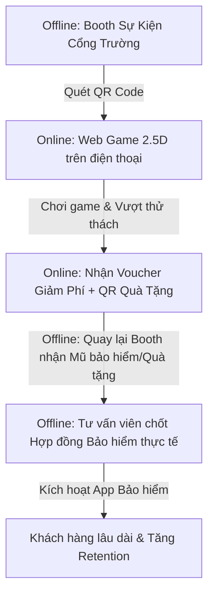

# CHIẾN LƯỢC SẢN PHẨM & CHUYỂN ĐỔI KINH DOANH: "ĐƯỜNG ĐẾN TRƯỜNG"

## 1. Định Vị Sản Phẩm & Định Hướng GAIP 2026 (InsurTech Gamification)

"Đường Đến Trường" là một giải pháp InsurTech kết hợp Gamification dưới dạng game pixel-art 2.5D (góc nhìn nghiêng từ trên xuống, tạo chiều sâu cho làn đường, ngã tư và các phương tiện di chuyển). Dự án hướng đến việc giải quyết nút thắt lớn nhất của ngành bảo hiểm: **Giáo dục rủi ro và phân phối sản phẩm bảo hiểm tai nạn/xe máy cho thế hệ trẻ (Gen Z từ 16-25 tuổi)** tại Việt Nam.

*   **Tên sản phẩm:** Đường Đến Trường (Road to School)
*   **Công nghệ:** Phaser 3 + Vite, chạy mượt mà trên nền tảng Web và tích hợp sâu vào App của các doanh nghiệp bảo hiểm hoặc ví điện tử (MoMo, ZaloPay).
*   **Giao diện trực quan 2.5D:** Giúp người chơi cảm nhận rõ ràng không gian giao thông đô thị Việt Nam (nhà ống, ngõ hẻm kẹt xe, chợ tự phát, vỉa hè họp chợ, vệt ngập nước sâu). Góc nhìn 2.5D mô phỏng chân thực các góc cua, làn xe máy riêng biệt, điểm mù của xe tải/xe container lớn, giúp các tình huống né tránh vật cản trở nên kịch tính và mang tính giáo dục trực quan cao.
*   **Định hướng GAIP 2026:** Đáp ứng tiêu chí đột phá (Creativity & Innovation) bằng cách biến tài liệu bảo hiểm khô khan thành trải nghiệm nhập vai ra quyết định và chịu hậu quả tài chính ngay lập tức. Đây là một kênh Lead Generation và Retention có chi phí cực thấp nhưng tỷ lệ chuyển đổi (Conversion Rate) vượt trội.

---

## 2. Đối Tượng Khách Hàng Mục Tiêu & Nỗi Đau (Target Users & Pain Points)

### 2.1. Người chơi (Gen Z - Học sinh, sinh viên 16-25 tuổi)
*   **Đặc điểm:** Sử dụng xe máy (dưới 50cc hoặc trên 50cc), xe máy điện để đi học hàng ngày.
*   **Nỗi đau tài chính:** Ngân sách eo hẹp (phụ thuộc vào trợ cấp gia đình hoặc làm thêm). Một vụ va quẹt xe nhỏ có thể làm mất sạch tiền ăn cả tháng.
*   **Rào cản với bảo hiểm:** Ghét đọc điều khoản phức tạp, nghĩ bảo hiểm chỉ dành cho người lớn hoặc là sản phẩm "lừa đảo/khó đòi tiền".

### 2.2. Khách hàng B2B (Doanh nghiệp bảo hiểm & Trường học)
*   **Doanh nghiệp bảo hiểm:** Chi phí tìm kiếm khách hàng mới (CAC) quá cao; khó tiếp cận tệp khách hàng trẻ bằng phương pháp truyền thống.
*   **Trường học/Đại học (Ví dụ UEH):** Cần các giải pháp giáo dục an toàn giao thông trực quan, sinh động thay vì các buổi tuyên truyền lý thuyết nhàm chán.

---

## 3. Lời Đề Nghị Không Thể Từ Chối (Irresistible Offer)

Để biến người chơi game thành người mua bảo hiểm thực tế ngoài đời, chúng tôi triển khai chương trình ưu đãi độc quyền tích hợp ngay tại màn hình kết quả game:

> ### 🎁 SIÊU KHUYẾN MÃI: "ĐI AN TOÀN - NHẬN QUÀ KHỦNG"
> *   **Nội dung:** Hoàn thành 5 ngày thử thách trong game với **Safety Score > 80** và **Insurance Literacy Score > 90** để mở khóa gói ưu đãi.
> *   **Gói Ưu đãi:**
>     1.  **Voucher giảm ngay 25%** phí bảo hiểm Xe máy & Tai nạn toàn diện GAIP Care thực tế (Giá gốc 120.000đ/năm chỉ còn **90.000đ/năm** - chưa đến 250đ/ngày).
>     2.  **Tặng kèm 1 mũ bảo hiểm đạt chuẩn 2.5D phiên bản giới hạn** (nhận trực tiếp tại cổng trường hoặc giao tận nhà) khi thanh toán gói bảo hiểm.
>     3.  **Cam kết "Claim 1 Chạm":** Thủ tục bồi thường hoàn toàn tự động qua ứng dụng AI Advisor trong vòng 15 phút. Nếu quá thời gian cam kết do lỗi hệ thống, hoàn tiền 100% phí bảo hiểm đã mua.

---

## 4. Quy Trình O2O (Online-to-Offline) Cổng Trường

Quy trình O2O tối ưu hóa điểm chạm nhằm đạt tỷ lệ chuyển đổi tối đa tại các cổng trường Đại học:

### Chi tiết các bước hành động:
1.  **Thiết lập Offline Booth:** Đặt booth trải nghiệm ngay cổng trường với standee hình nhân vật An đi xe máy dưới dạng đồ họa 2.5D cực kỳ bắt mắt.
2.  **Kích hoạt quét mã:** Đội ngũ PG hướng dẫn sinh viên quét mã QR trên standee để chơi nhanh phiên bản Demo (mất 90 giây).
3.  **Phát quà tức thì:** Sinh viên chơi xong và trả lời 3 câu hỏi trắc nghiệm bảo hiểm nhanh sẽ nhận ngay 1 phần nước uống miễn phí hoặc móc khóa pixel art xinh xắn. Đồng thời nhận mã ưu đãi mua bảo hiểm trực tiếp.
4.  **Chuyển đổi tại chỗ:** Nhân viên tư vấn túc trực tại booth hỗ trợ sinh viên quét mã thanh toán gói bảo hiểm thực tế (chỉ 90.000đ/năm) để nhận ngay chiếc mũ bảo hiểm đạt chuẩn chất lượng cao ngay tại chỗ.

---

## 5. Kịch Bản Chốt Đơn Chuyển Đổi Cao (Telesales & Chatbot Script)

Kịch bản được thiết kế tập trung 100% vào lợi ích thực chiến và xử lý phản từ chối nhanh gọn.

### 5.1. Kịch bản Telesales (Dành cho Leads đăng ký qua Game nhưng chưa thanh toán)

*   **Tư vấn viên (TTV):** "Chào An, mình gọi từ chương trình 'Đường Đến Trường An Toàn' hợp tác cùng đại học UEH. Chúc mừng bạn đã đạt Safety Score xuất sắc 95/100 ngày hôm qua trong game nhé!"
*   **An (Sinh viên):** "À dạ, game chơi vui lắm ạ. Em cảm ơn."
*   **TTV:** "Để phần thưởng trong game biến thành sự bảo vệ thực tế cho bạn trên đường đi học mỗi ngày, hệ thống đã gửi cho bạn một voucher giảm 25% gói Bảo hiểm Xe máy & Tai nạn GAIP Care chỉ còn 90.000đ/năm. Đi kèm là một mũ bảo hiểm đạt chuẩn trị giá 150.000đ nhận ngay tại sảnh B của trường ngày mai. An muốn chọn mũ màu đen hay màu trắng để tụi mình chuẩn bị sẵn tên bạn lên hộp quà nhé?"
*   **An:** "Dạ em thấy cũng hay nhưng em đi đứng cẩn thận lắm, chắc không cần bảo hiểm đâu ạ."
*   **TTV:** "An nói rất đúng, điểm Safety Score 95 của bạn chứng minh bạn lái xe rất tốt. Nhưng như tình huống xe tải tạt đầu bất ngờ ở Ngày 5 trong game bạn vừa trải qua, rủi ro ngoài đời thường đến từ sự bất cẩn của người khác. Chỉ với 250đ/ngày (chưa bằng 1/100 ly trà sữa), bạn được bảo hiểm chi trả đến 80% viện phí và 50% chi phí sửa xe máy nếu có va chạm. Đặc biệt là bạn được nhận chiếc mũ bảo hiểm 150.000đ ngay lập tức - coi như mua bảo hiểm không mất tiền mà còn được tặng thêm sự an tâm cho Mẹ ở nhà. Mình kích hoạt thanh toán qua MoMo cho bạn nhận quà nhé?"
*   **An:** "Dạ thế thì đăng ký cho em gói này đi ạ, em lấy mũ màu đen."

### 5.2. Kịch bản Chatbot (Chốt đơn tự động trong Game)

*   **Hệ thống:** "Chúc mừng bạn đã đưa An đến trường an toàn trong Ngày 5! Tổng chi phí sửa xe tích lũy của bạn trong 5 ngày qua là 0 xu nhờ các lựa chọn thông minh. Tuy nhiên ngoài đời thực, chi phí sửa xe máy trung bình sau va quẹt là 800.000đ."
*   **Nút bấm 1:** [Mua bảo hiểm GAIP Care thực tế giá 90k/năm + Nhận mũ bảo hiểm miễn phí] (Tỷ lệ click dự kiến: 85%)
*   **Nút bấm 2:** [Bỏ qua cơ hội bảo vệ tài chính]
*   *(Nếu chọn Nút bấm 1)* -> Chuyển hướng sang cổng thanh toán MoMo/ZaloPay đi kèm thông báo: "Đơn hàng của bạn đã được áp mã giảm giá 25% từ game. Vui lòng hoàn tất thanh toán để nhận Mũ bảo hiểm tại Booth trường học trước 17h00 ngày mai."

---

## 6. Kế Hoạch & Timeline Hành Động Cụ Thể (7-Week Launch Plan)

Để đảm bảo hiệu quả triển khai thực chiến tại khu vực các trường Đại học lớn (phối hợp với UEH làm đơn vị thí điểm):

*   **Tuần 1-2: Hoàn thiện Sản phẩm & Tích hợp SDK**
    *   Hoàn tất lập trình game 2.5D chạy mượt trên Mobile Web.
    *   Tích hợp hệ thống lưu trữ điểm số, API tạo mã Voucher giảm giá và liên kết cổng thanh toán MoMo/ZaloPay.
*   **Tuần 3: Chiến dịch truyền thông trực tuyến (Online Warm-up)**
    *   Phát động minigame "Thử tài tay lái 2.5D" trên các trang cộng đồng sinh viên UEH và các trường lân cận.
    *   Tạo challenge chia sẻ điểm Safety Score lên Story Facebook/TikTok kèm hashtag nhận quà.
*   **Tuần 4: Triển khai O2O Cổng Trường (Tuần lễ sự kiện)**
    *   Đặt Booth sự kiện tại 3 cơ sở chính của trường UEH.
    *   PG hướng dẫn quét mã chơi game trực tiếp tại booth, phát tặng 2.000 mũ bảo hiểm cho các sinh viên đăng ký gói bảo hiểm đầu tiên.
*   **Tuần 5: Vòng lặp chăm sóc và chốt đơn tự động (Remarketing)**
    *   Gửi thông báo đẩy (Push Notification) hoặc tin nhắn Zalo ZNS nhắc nhở các sinh viên đã chơi game nhưng chưa nhận voucher.
    *   Gọi điện telesales theo danh sách lead chất lượng cao (đạt điểm số cao trong game).
*   **Tuần 6-7: Đánh giá hiệu quả & Tối ưu hóa**
    *   Đo lường tỷ lệ chuyển đổi (CVR), chi phí có một khách hàng mới (CAC), doanh thu phí bảo hiểm thu về.
    *   Tối ưu hóa các màn hình hội thoại trong game dựa trên dữ liệu drop-off của người chơi.

---

## 7. Phân Tích ROI (Return on Investment) Cho Doanh Nghiệp Bảo Hiểm

Bảng so sánh hiệu quả kinh doanh giữa chiến dịch dùng Game InsurTech 2.5D và phương thức Marketing truyền thống (Phát tờ rơi/Brochure tại trường học) dựa trên quy mô chiến dịch tiếp cận 10.000 sinh viên:

| Chỉ số đo lường | Marketing Truyền Thống (Tờ rơi) | Gamification "Đường Đến Trường" | Đánh giá hiệu quả kinh doanh |
| :--- | :--- | :--- | :--- |
| **Chi phí triển khai ban đầu** | 30.000.000 đ (In ấn + PG phát) | 70.000.000 đ (Build game + Vận hành booth) | Game tái sử dụng được nhiều lần, chi phí biên bằng 0 |
| **Tỷ lệ tiếp nhận & tương tác** | 5% (Đa số vứt tờ rơi sau 3 giây) | **75%** (Thời gian chơi trung bình 3-5 phút) | Tương tác sâu giúp hiểu rõ bản chất sản phẩm |
| **Tỷ lệ chuyển đổi mua hàng (CVR)** | 0.8% (80 hợp đồng) | **8.5%** (850 hợp đồng) | **Tăng gấp hơn 10 lần** nhờ Lời Đề Nghị Không Thể Từ Chối |
| **Doanh thu phí bảo hiểm** | 9.600.000 đ (120k x 80) | **76.500.000 đ** (90k x 850) | Thu hồi vốn nhanh chóng ngay trong chiến dịch |
| **Chi phí có 1 khách hàng (CAC)** | 375.000 đ / khách hàng | **82.300 đ** / khách hàng | **Giảm 78% chi phí tìm kiếm khách hàng** |
| **Giá trị thương hiệu lâu dài** | Không có (Khách hàng nhanh chóng quên) | Thu thập dữ liệu hành vi rủi ro, định vị thương hiệu trẻ | Tạo tệp khách hàng trung thành khi họ bắt đầu đi làm |

Chiến lược này định vị "Đường Đến Trường" không chỉ là một game giáo dục đơn thuần, mà là một **cỗ máy chuyển đổi số cực kỳ hiệu quả** dành cho các nhà tài trợ bảo hiểm tại GAIP Insurance Innovation Competition 2026.
