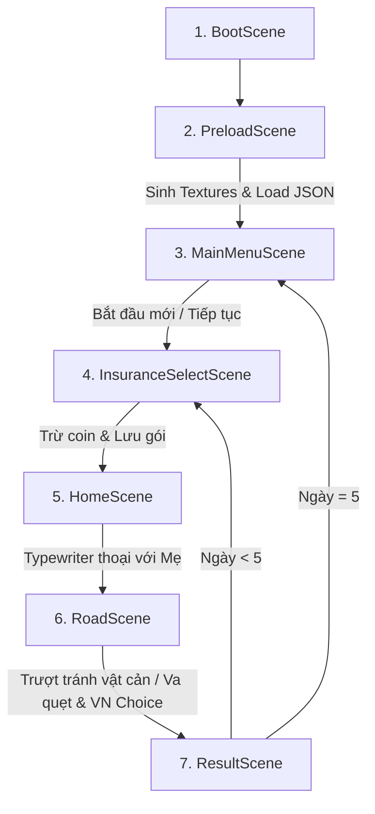

# ĐẶC TẢ KIẾN TRÚC KỸ THUẬT (TECHNICAL ARCHITECTURE)
## Dự án: Game giáo dục bảo hiểm InsurTech “Đường Đến Trường”

Dự án này sử dụng mô hình lập trình hướng sự kiện trên nền tảng **Phaser 3** kết hợp công cụ đóng gói **Vite**. Nhằm đáp ứng mục tiêu hoạt động độc lập, không phụ thuộc tài nguyên bên ngoài (zero-asset dependency), toàn bộ đồ họa và âm thanh được khởi tạo lập trình qua Canvas và Web Audio API.

---

## 1. Bản Đồ Tổng Quan Scene Flow

Hành trình game trải qua 7 Scene chính được đăng ký tuần tự trong `src/main.js`:



---

## 2. Mô Hình Dữ Liệu & State Quản Lý

Mọi trạng thái tiến trình của người chơi được lưu trữ tập trung tại `gameState` và đồng bộ qua lớp tĩnh `SaveSystem` bằng `localStorage`.

### 2.1. Cấu Trúc Trạng Thái Game (Game State Structure)
```javascript
{
  day: 1,                 // Ngày hiện tại (1 - 5)
  coins: 500,             // Số dư coin tài chính trong game
  safetyScore: 100,       // Điểm lái xe an toàn (Safety Score)
  insuranceLiteracy: 100, // Điểm hiểu biết bảo hiểm
  selectedInsuranceId: "none", // ID gói bảo hiểm đang mua ("none" | "basic" | "mobility")
  health: 100,            // Thanh sức khỏe sinh viên (0 - 100)
  history: [              // Nhật ký lịch sử lưu trữ từng ngày để tổng kết
    {
      day: 1,
      selectedInsuranceId: "basic",
      accidents: 1,
      medicalCost: 60,
      repairCost: 0,
      covered: 36,
      outOfPocket: 24,
      safetyScore: 105,
      coinsBalance: 496
    }
  ]
}
```

---

## 3. Hệ Thống Tính Toán Quyền Lợi Bảo Hiểm (InsuranceSystem)

Khi xảy ra va chạm, game tính toán tổn thất dựa trên loại tai nạn. Các khoản chi trả bảo hiểm được khấu trừ theo tỷ lệ bảo vệ quy định:

| Gói Bảo Hiểm (Package) | Phí Mua (Premium) | Tỷ lệ Y tế (Medical Coverage) | Tỷ lệ Sửa Xe (Repair Coverage) | Điểm đặc biệt |
| :--- | :---: | :---: | :---: | :--- |
| **Không tham gia** (`none`) | 0 xu | 0% | 0% | Tự chi trả toàn bộ khi tai nạn |
| **Học đường Cơ bản** (`basic`) | 30 xu | 60% | 0% | Chỉ hỗ trợ y tế học sinh |
| **BH An toàn Di chuyển** (`mobility`) | 70 xu | 80% | 60% | Hỗ trợ sửa xe & cứu hộ |

### Công thức tính chi phí tự chi trả (Out-of-Pocket Cost):
$$\text{Out-of-pocket Medical} = \text{Base Medical} \times (1 - \text{Medical Coverage})$$
$$\text{Out-of-pocket Repair} = \text{Base Repair} \times (1 - \text{Repair Coverage})$$
$$\text{Total Deducted} = \text{Out-of-pocket Medical} + \text{Out-of-pocket Repair}$$

---

## 4. Công Nghệ Đồ Họa Pseudo-3D (RoadScene Perspective Engine)

Để tái hiện góc nhìn **2.5D Retro Arcade** (như Road Fighter/OutRun) mà không cần file đồ họa nặng, `RoadScene` vẽ trực tiếp hệ thống đường thu hẹp về phía chân trời.

```
       Chân trời (Horizon) Y = 200px (Độ rộng = 70px)
             /=================\
            /     .       .     \
           /      .       .      \
          /       .   [Vật cản]   \
         /        .       .        \
        /         .       .         \
       /          .       .          \
      /           .       .           \
     /            .       .            \
    /=============|=======|=============\
  Mép đường dưới Y = 560px (Độ rộng = 500px)
```

### 4.1. Toán Học Chiếu Phối Cảnh (Perspective Projection)
Mọi đối tượng (Vật cản, Vạch kẻ đường) được lưu trữ theo tọa độ sâu $z$ chạy từ $1.0$ (Chân trời - rất xa) về $0.0$ (Màn hình dưới - sát người chơi).

1. **Độ rộng đường tại tọa độ sâu $z$:**
   $$W(z) = W_{\text{horizon}} + (W_{\text{bottom}} - W_{\text{horizon}}) \times (1 - z)$$
2. **Tọa độ Y trên màn hình:**
   $$Y_{\text{screen}}(z) = Y_{\text{horizon}} + (Y_{\text{bottom}} - Y_{\text{horizon}}) \times (1 - z)$$
3. **Tọa độ X trên màn hình** (dựa trên tỷ lệ lệch tâm $x \in [-1.0, 1.0]$):
   $$X_{\text{screen}}(x, z) = X_{\text{center}} + x \times (W(z) \times 0.42)$$
4. **Tỷ lệ Scale của Sprite:**
   $$\text{Scale}(z) = 0.15 + (1.0 - z) \times 0.85$$

### 4.2. Hiệu Ứng Vật Lý Trơn Trượt (Rain Slipperiness)
Ở **Ngày 2 (Trời mưa)**, lốp xe giảm ma sát. Hệ thống lái chuyển sang cơ chế lực quán tính (Inertia Slide):
* **Bình thường:** Vận tốc $V_x$ phanh hãm ngay bằng lực cản không khí: $V_x \leftarrow V_x \times 0.82$.
* **Trời mưa:** Lực cản giảm mạnh $V_x \leftarrow V_x \times 0.95$. Khi nhả phím di chuyển, xe tiếp tục trôi trượt nhẹ sang hai bên, mô tả trực quan rủi ro trơn trượt được cảnh báo trước.

---

## 5. Hệ Thống Hộp Thoại Trực Quan & Sự Lựa Chọn (DialogSystem)

`DialogSystem` tạo một lớp overlay glassmorphic tại bottom canvas:
* **Hiệu ứng đánh chữ (Typewriter):** Hiển thị ký tự tuần tự mỗi $25\text{ms}$. Có khả năng Skip nhanh khi nhấn chuột/phím Space.
* **Hội thoại quyết định (VN Choice Menu):** Tạo danh sách các Button dọc khi va quẹt. Khi di chuột qua, các nút chuyển màu và phát âm thanh chirp. Khi chọn, hệ thống áp dụng tác động trực tiếp lên $4$ biến số: `health`, `coins`, `safetyScore`, `insuranceLiteracy`, đồng thời trigger quy trình nộp hồ sơ yêu cầu bồi thường bảo hiểm giả lập nếu có gói bảo hiểm tương ứng bảo vệ.

---

## 6. Bộ Tổng Hợp Âm Thanh Lập Trình (Web Audio API Synth)

Để đảm bảo không bao giờ bị lỗi thiếu file tiếng động (audio loading error), toàn bộ nhạc hiệu và âm thanh hiệu ứng được sinh trực tiếp bằng code qua Web Audio API:

1. **Tiếng tích thoại (Typewriter Blip):** Sóng tam giác (`triangle`) tần số ngẫu nhiên $140\text{Hz} - 180\text{Hz}$ trong thời lượng cực ngắn $0.04$ giây.
2. **Chime thành công (Success Arpeggio):** Phát hợp âm E5 ($659.25\text{Hz}$) $\rightarrow$ G5 ($783.99\text{Hz}$) $\rightarrow$ C6 ($1046.50\text{Hz}$) cách nhau $0.06$ giây tạo cảm giác hưng phấn retro.
3. **Tiếng đụng độ (Crash rumble):** Sóng răng cưa (`sawtooth`) bắt đầu từ tần số $100\text{Hz}$ trượt nhanh xuống $10\text{Hz}$ cùng hiệu ứng tắt âm theo hàm mũ, mô phỏng tiếng va chạm động cơ trầm đục.
